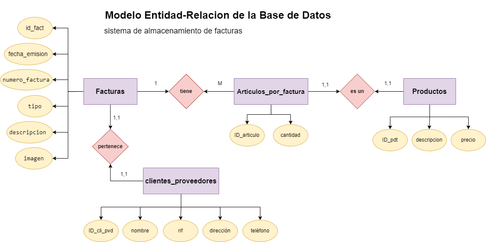
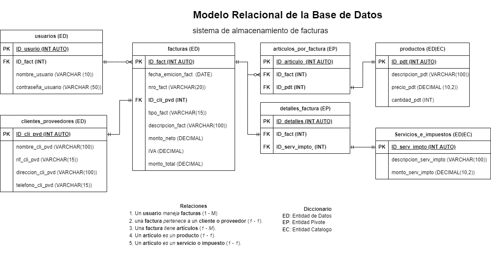

# Base de Datos

## Tablas
**Facturas (ED)**
- id_fact **(PK)**
- fecha_emision
- numero_factura
- id_cliente_proveedor **(FK)**
- tipo
- descripcion 
- imagen

**Articulos_por_factura (EP)**
- id_articulo **(PK)**
- id_fact **(FK)**
- id_producto **(FK)**
- cantidad

**Clientes_Provedores (ED)**
- id_cliente_proveedor **(PK)**
- nombre
- rif
- dirección
- telefono

**Productos (ED)**
- id_producto **(PK)**
- descripcion
- precio

## Relaciones
1. una factura _pertenece_ a un cliente o proveedor (relacion 1 a 1)
1.  una factura _tiene_  articulos
 (relacion 1 a muchos)
1. un articulo _es un_ producto (relacion 1 a 1)

 ## Diccionario

- **ED** entidad de Datos
- **EP** entidad Pivote
- **PK** llave primaria
- **FK** llave foranea

## Modelo Entidad-Relación

## Modelo Relacional de la BD
 

##  Reglas de Negocio

### clientes_proveedores
1. Crear un cliente.
1. Leer todos los clientes.
1. Leer un cliente en particular.
1. Actualizar un cliente.
1. Eliminar un cliente.

### productos
1. Crear un producto.
1. Leer todos los productos.
1. Leer un producto en particular.
1. Actualizar un producto.
1. Eliminar un producto.

### facturas
1. Crear una factura.
1. Leer todas las facturas.
1. Leer una factura en particular.
1. Leer todas las facturas de un cliente.
1. Leer todas las facturas de un producto.
1. Actualizar una factura.
1. Eliminar una factura.

### articulos_por_factura
1. Crear un artículo.
1. Leer todos los artículos.
1. Leer un artículo en particular.
1. Actualizar un artículo.
1. Eliminar un artículo.